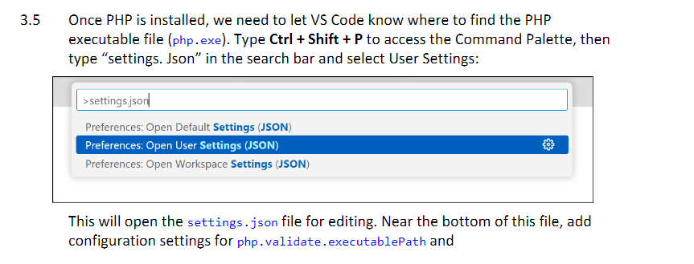
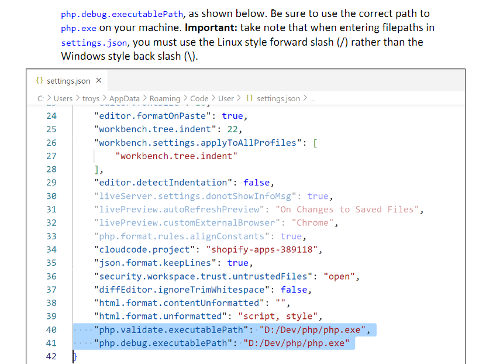
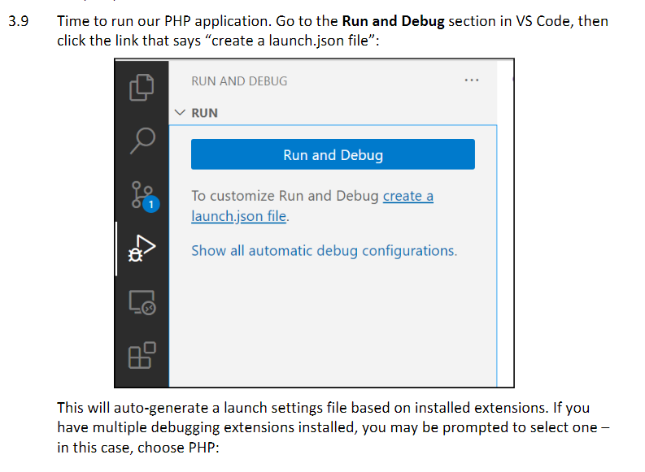
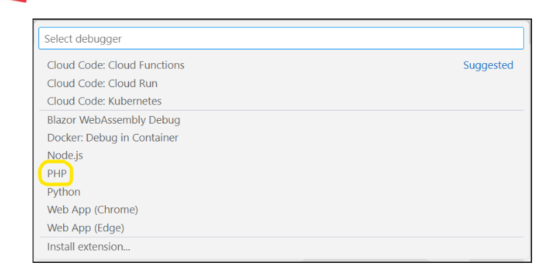
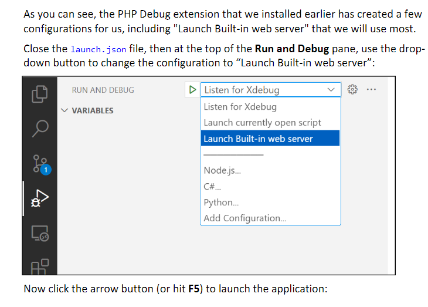
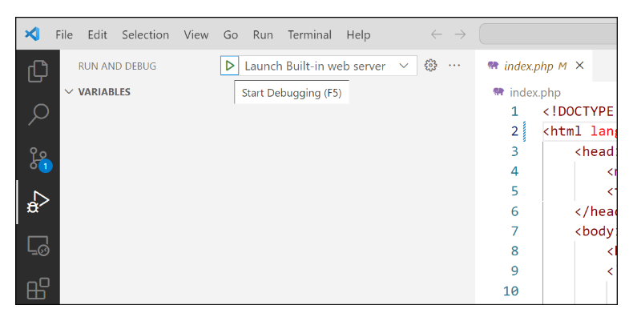

# Environment Setup 
## 1. Download composer from https://getcomposer.org/download/  
## 2. Open Project Root folder and install composer

``` shell
composer install
```


## 3. Create Project .env file
```
DB_HOST=35.212.179.183
DB_USERNAME=inf2003-sqldev
DB_PASSWORD=toor
DB_NAME=ELibDatabase
```
.env file should reside in the root project folder.

## 4. DownLoad PHP
Download PHP from https://windows.php.net/download  
Download PHP VSCODE Extension from https://marketplace.visualstudio.com/items?itemName=xdebug.php-debug


## 5. Install php







# User Account Login Credentials
## Admin Login
```
email: admin@admin.com
pw: test
```
## User Login
```
email: sallygoh@gmail.com
pw: 12345
```